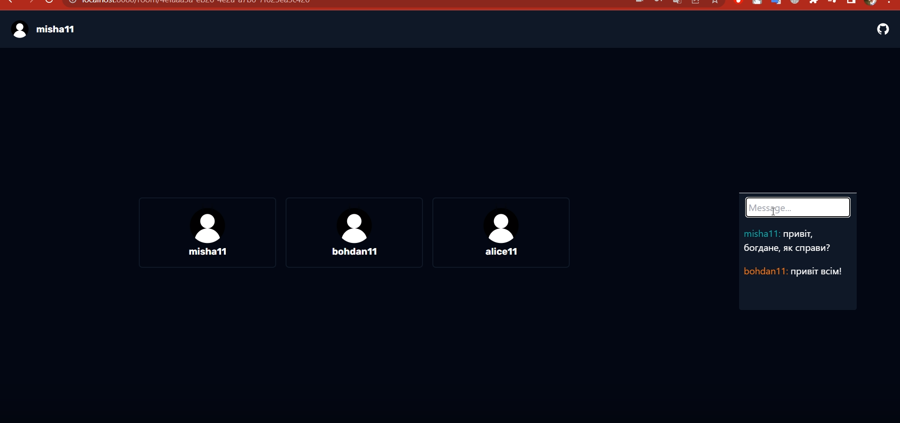
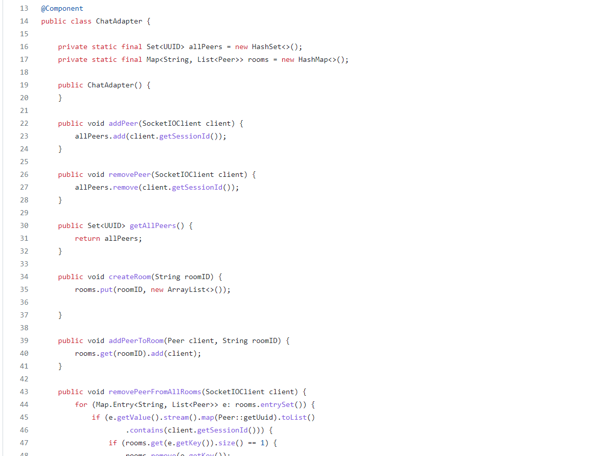
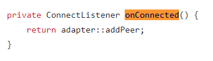
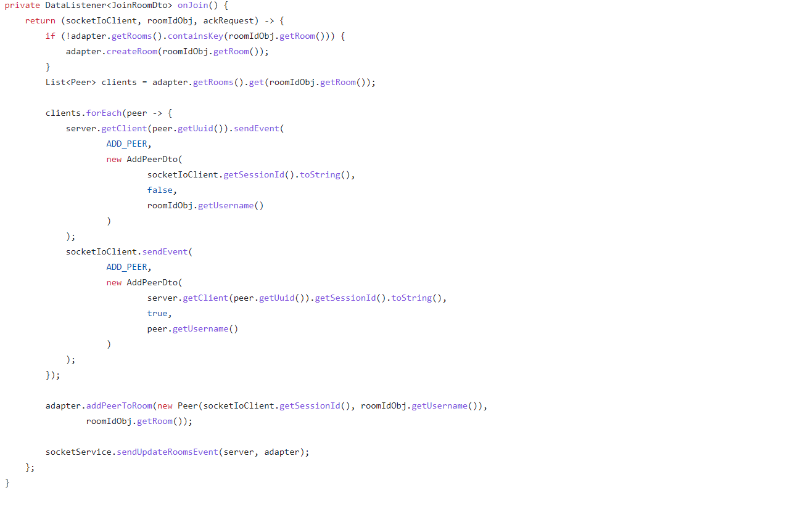
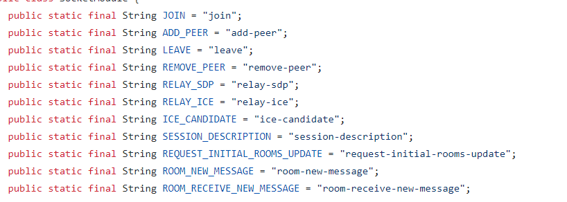

# Application Video Presentation
https://www.loom.com/share/854d69f5fab24f31a8a20cb594f64ddc

# Summary
The project is developed using the react + spring boot stack and represents an implementation of a user-friendly online chat system utilizing WebRTC and sockets. It features both text and voice chat options, a simple and friendly UI, as well as JWT authentication.

# Backend & Frontend
- [How to start?](https://github.com/mishok321/dark-chat-back#how-to-start) (backend)
- [How to start?](https://github.com/mishok321/dark-chat-front#how-to-start) (frontend)

# How voice chat works?
#### A brief description of how the logic related to peer-to-peer connections works, as written in [SocketModule](https://github.com/mishok321/dark-chat-back/blob/master/src/main/java/com/misha/darkchatback/socket/SocketModule.java)
The heart of the application is the [`ChatAdapter`](https://github.com/mishok321/dark-chat-back/blob/master/src/main/java/com/misha/darkchatback/adapter/ChatAdapter.java). Upon each new connection, it creates a new [`Peer`](https://github.com/mishok321/dark-chat-back/blob/master/src/main/java/com/misha/darkchatback/adapter/Peer.java) object and adds it to the `allPeers`. This class is designed to manage all connections and group them by chat rooms.

After the client is added to the allPeers set, the backend starts listening to the join event.

After the `join` event is received, the client begins to establish a p2p connection with all other participants in the room for real-time audio transmission. This is done through the ADD_PEER event, which the server sends to each client in the room, along with a boolean value (true for the client initializing the p2p connection by creating an offer, false for all other clients creating an answer), the client's ID, and their username. After that, the socket server acts as a signaling server, receiving and relaying ice candidates and offers from clients through the RELAY_ICE and RELAY_SDP events.

The same applies to other events, depending on their logic.
